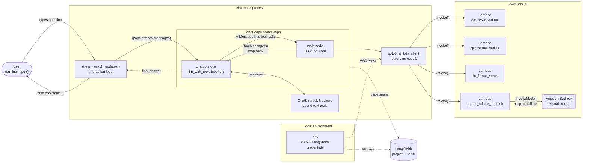
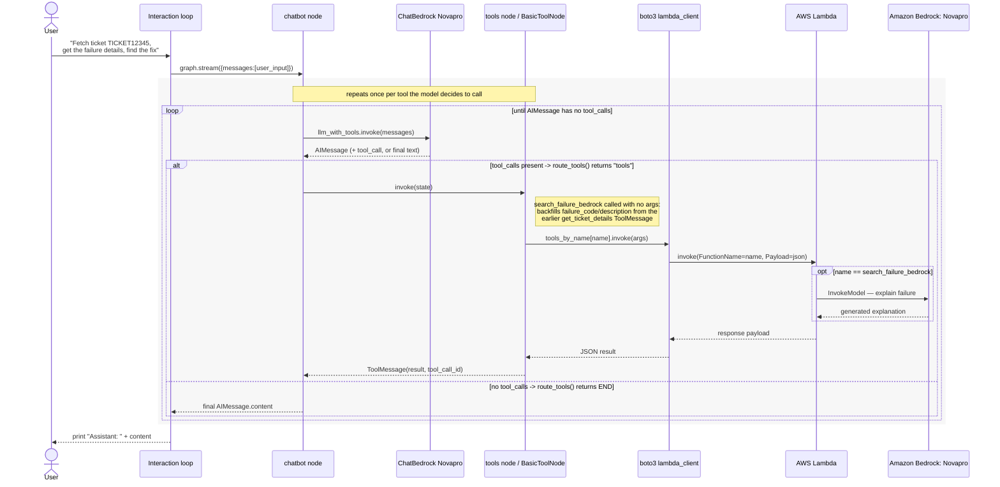

# Ticket Triage Chatbot — Diagrams

A LangGraph agent that resolves support tickets by calling four AWS Lambda functions as tools — fetching ticket and failure details, retrieving fix steps, and optionally asking Amazon Bedrock to explain a failure in plain language.

## 1. Architecture

The notebook process holds the LangGraph state machine and the LLM binding; every tool call leaves the process as a `boto3` invocation against a named Lambda function in AWS. One of those functions, `search_failure_bedrock`, makes a further call out to Amazon Bedrock.

The four LangChain `@tool` functions are thin wrappers: each serializes its arguments to JSON and calls a same-named AWS Lambda function via `lambda_client.invoke()`. Only `search_failure_bedrock` has a second hop, from its Lambda into Amazon Bedrock.

## 2. Request sequence

Walking through the notebook's first example prompt — *"Fetch ticket TICKET12345, get the failure details, then find the fix."* The graph alternates between the chatbot node and the tools node until the model responds with no further tool calls.

Every pass through the loop is one `chatbot → tools → chatbot` round trip: the graph only exits to `END` once `route_tools()` sees an `AIMessage` with no `tool_calls`.

## 3. Tools reference

All four tools share the same shape — serialize arguments, invoke a same-named Lambda, return its JSON payload.

| LangChain tool | Lambda function | Called with | Purpose |
|---|---|---|---|
| `get_ticket_details` | `get_ticket_details` | `ticket_id` | Look up a support ticket's stored details, including its failure code. |
| `get_failure_details` | `get_failure_details` | `failure_code` | Return detailed information about a specific failure code. |
| `fix_failure_steps` | `fix_failure_steps` | `failure_code` | Return the resolution / fix steps for a failure code. |
| `search_failure_bedrock` | `search_failure_bedrock` | `failure_info` (dict) | Ask a Bedrock model (Mistral) to explain a failure in natural language; `BasicToolNode` fills in the argument from an earlier `get_ticket_details` result when the model calls it empty. |

## Implementation note

The notebook imports `ChatBedrock` from `langchain_aws` but the `chatbot` node actually instantiates `ChatBedrock Novapro`, a class that isn't imported anywhere in the shown cells. The diagrams above reflect the code as written — the reasoning model is Nova Pro via `ChatBedrock `, and Bedrock is only reached indirectly through the `search_failure_bedrock` Lambda. If Bedrock was meant to be the main model, swap in `ChatBedrock` (and drop the unused import if not).
